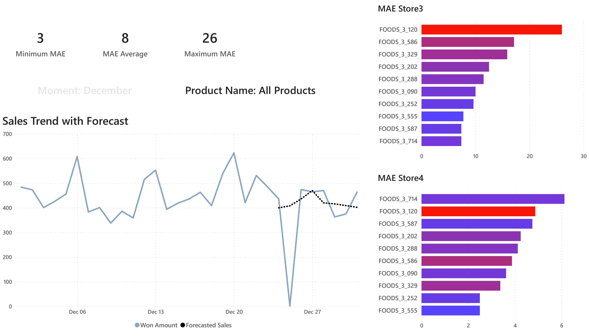
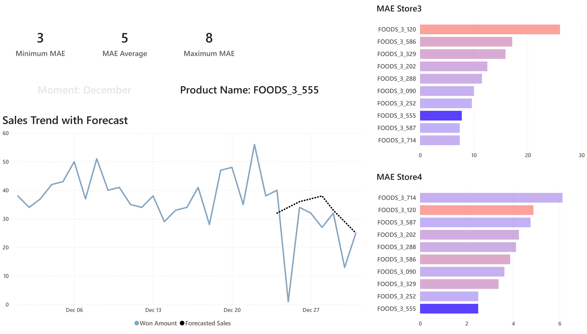
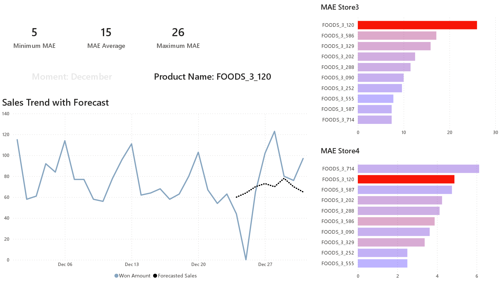
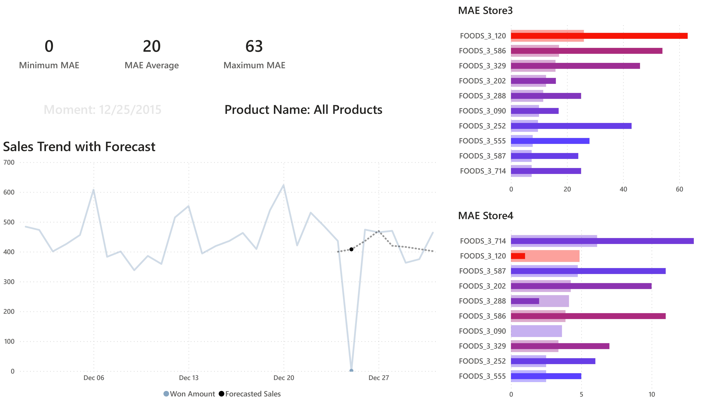

Update date: Mar 17, 2024

# **Forecasting Retail**

### **Objetive**

Generate a sales forecasting solution for a large distributor in the food sector with the purpose of contributing to the reduction of warehouse costs and increasing income by reducing stockouts, through the development of machine learning models to project sales in the next 8 days at the store-product level.

### **Data preparation**

To train the machine learning models, the administration has commissioned [data preparation](notebooks/01_forecasting_prepare_data.ipynb) from a database that contains 3 years of historical sales. 

### **Modeling Methodology**

For the development of the models, a guided and structured process was followed in the following steps and available in the corresponding [notebook](notebooks/03_forecasting_production_code.ipynb):

* Import data

* Data quality

* Exploratory data analysis

* Transform variables

* Modeling

* Evaluation

For the implementation of the models in the production environment, the [training](production/trainingretail.py) and [execution](production/executionretail.py) scripts were prepared for subsequent delivery to the IT team.

## **Conclusions**

### **Dashboard Sales Forecast**

### **Model evaluation**

* In terms of the accuracy of product projection at the store level, the Mean Absolute Error (MAE) metric was around 8 units.
* The performance of the models better projects for products from store 4 with a MAE less than 6 units.

 

* The models for the products FOODS_3_555 and FOODS_3_120 obtained the best and worst performance, respectively.

 

* A significant change is detected in the MAE metric for December 25 due to it being a holiday and NO sales have been gained, so corrective measures will have to be taken or further investigated as necessary.

**ACC**

S2!