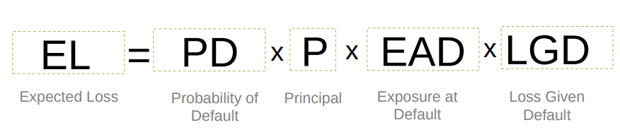
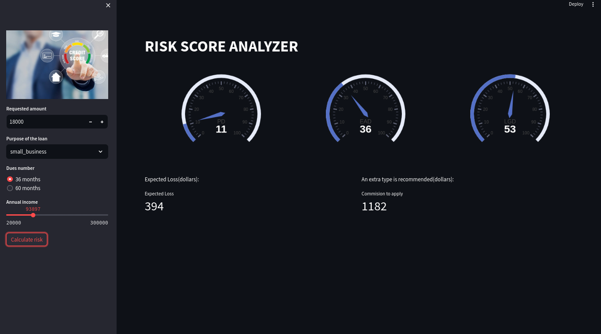

Update date: Mar 28, 2024

# **Risk Scoring**

### **Objetive**
Project the Expected Loss(EL) when granting a bank loan, with the purpose of evaluating the risk before providing it to the client, using machine learning models with a risk scoring approach:

### **Data preparation**

To train the machine learning models, the administration has commissioned [data preparation](notebooks/01_riskscoring_prepare_data.ipynb) based on historical loans to 200,000 clients. 

### **Modeling Methodology**

For the development of the models, a guided and structured process was followed in the following steps and available in the corresponding [notebook](notebooks/05_riskscoring_production_code.ipynb):

* Import data

* Data quality

* Exploratory data analysis

* Transform variables

* Modeling

* Evaluation

For the implementation of the models in the production environment, the [training](production/trainingrisks.py) and [execution](production/executionrisks.py) scripts were prepared for subsequent delivery to the IT team.

## **Conclusions**

### **[Risk Score Analyzer]()**

* Prototype of the [application]() of models to project Expected Loss(EL) and the recommended commission to be applied by the bank

 

**ACC**

S2!